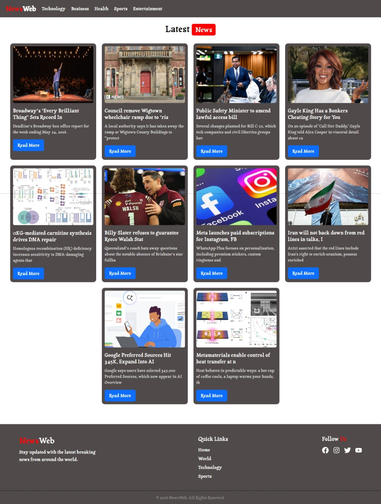

# 📰 NewsWeb

A modern and responsive news web application built using React.js.
This project fetches real-time news articles using the GNews API and displays them in a clean, category-based UI.

🌐 **Live Demo:**
[NewsWeb Live Website](https://v-newsweb.netlify.app/)

---

## 🚀 Features

* 🔥 Latest trending news
* 📂 Category-based news filtering
* 📱 Fully responsive design
* ⚡ Fast and clean UI
* 🌐 Real-time API data fetching
* 🎨 Custom modern navbar & cards
* 🔍 Dynamic news updates

---

## 🛠️ Built With

* ⚛️ React.js
* 🎨 CSS3
* 🌐 GNews API
* 🚀 Netlify Deployment

---

## 📸 Screenshots



---

## ⚙️ Installation

Clone the repository:

```bash
git clone https://github.com/Vallarasu-KSG/News-Web-App.git
```

Go to the project folder:

```bash
cd newsweb
```

Install dependencies:

```bash
npm install
```

Start the development server:

```bash
npm start
```

---

## 🔑 Environment Variables

Create a `.env` file in the root folder and add:

```env
REACT_APP_API_KEY=YOUR_GNEWS_API_KEY
```

---

## 📂 Project Structure

```bash
src/
│
├── Components/
├── Pages/
├── App.js
├── index.js
└── styles/
```

---

## 🌍 API Used

* GNews API:
  [GNews API Link](https://gnews.io/login)

---

## 🚀 Deployment

This project is deployed using:

* Netlify

---

## 📌 Future Improvements

* 🌙 Dark mode
* 🔎 Search functionality
* 📑 Pagination
* ❤️ Bookmark feature
* 🌍 Multi-language support

---

## 👨‍💻 Author

Made with ❤️ by Jithan

GitHub:
[GitHub Profile](https://github.com/Vallarasu-KSG)

---

## 📜 License

This project is open source and available under the MIT License.
